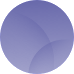

<div align="center">

</div>

# Shb

[](https://github.com/Carthage/Carthage) [](https://raw.githubusercontent.com/hyperium/hyper/master/LICENSE)

A Swift helper for generating Sunrise, Sunset and Shabbat times. Fork of [ceeK/Solar](https://github.com/ceeK/Solar). 

In **Shb** (as opposed to **Solar**), a `Solar` is a generic type, thus giving the ability to provide custom calculation (zenith) information.

**Shb** performs its calculations locally using an algorithm from the [United States Naval Observatory](http://williams.best.vwh.net/sunrise_sunset_algorithm.htm), and thus does not require the use of a network.

## Usage

### Sunrise/sunset

Solar simply needs a date and a location specified as a latitude and longitude:

```swift
let solar = USNOSolar(date: someDate, latitude: 51.528308, longitude: -0.1340267)
let sunrise = solar.sunrise
let sunset = solar.sunset
```

Note that all dates are UTC. Don't forget to format your date into the appropriate timezone if required.

### Shabbat times

```swift
let shabbat = Shb(date: someDate, latitude: 31.771959, longitude: 35.217018)
let candles = shabbat.lightCandles
let start = shabbat.shabbatStarts
let ends = shabbat.shabbatEnds
```

### Providing your own calculation info

```swift
public enum CustomCalc : SolarCalculation {
    
    case civilSunset
    
    public var zenith: Double {
        return 96
    }
    
    public var sunriseSunset: SunriseSunset {
        return .sunset
    }
    
}
```

```swift
let customSolar = Solar<CustomCalc>(date: someDate, latitude: 31.771959, longitude: 35.217018)
let civilSunset = customSolar.calculate(.civilSunset)
```

### Types of sunrise and sunset

There are several types of sunrise and sunset that Solar generates. They differ by how many degrees the sun lies below the horizon:

- **Official** (~0°)

- **Civil** (6° below horizon)

- **Nautical** (12° below horizon)

- **Astromonical** (18° below horizon)

For more information, see https://www.timeanddate.com/astronomy/different-types-twilight.html

## Installation

**Shb** is available through Carthage. 

### Carthage

Add the `dreymonde/Shb` project to your [Cartfile](https://github.com/Carthage/Carthage/blob/master/Documentation/Artifacts.md#cartfile)

```ruby
github "dreymonde/Shb"
```

Then run `carthage update`

# License 

The MIT License (MIT)

Copyright (c) 2017 Chris Howell

Permission is hereby granted, free of charge, to any person obtaining a copy
of this software and associated documentation files (the "Software"), to deal
in the Software without restriction, including without limitation the rights
to use, copy, modify, merge, publish, distribute, sublicense, and/or sell
copies of the Software, and to permit persons to whom the Software is
furnished to do so, subject to the following conditions:

The above copyright notice and this permission notice shall be included in all
copies or substantial portions of the Software.

THE SOFTWARE IS PROVIDED "AS IS", WITHOUT WARRANTY OF ANY KIND, EXPRESS OR
IMPLIED, INCLUDING BUT NOT LIMITED TO THE WARRANTIES OF MERCHANTABILITY,
FITNESS FOR A PARTICULAR PURPOSE AND NONINFRINGEMENT. IN NO EVENT SHALL THE
AUTHORS OR COPYRIGHT HOLDERS BE LIABLE FOR ANY CLAIM, DAMAGES OR OTHER
LIABILITY, WHETHER IN AN ACTION OF CONTRACT, TORT OR OTHERWISE, ARISING FROM,
OUT OF OR IN CONNECTION WITH THE SOFTWARE OR THE USE OR OTHER DEALINGS IN THE
SOFTWARE.
